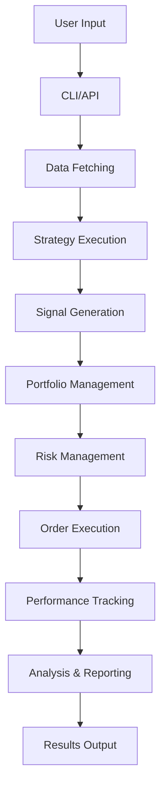

# System Architecture Overview

## Introduction

The Backtester framework is a modular, extensible system for cryptocurrency trading strategy development, backtesting, and analysis. Built on top of vectorbtpro, it provides a comprehensive toolkit for quantitative trading research.

## Architecture Principles

### Core Design Philosophy

1. **Modularity**: Each component has a single responsibility and clear interfaces
2. **Extensibility**: Easy to add new strategies, indicators, and analysis tools
3. **Performance**: Vectorized operations using pandas/numpy and vectorbtpro
4. **Simplicity**: Clean APIs that hide complexity from users
5. **Reliability**: Comprehensive error handling and validation

### Technology Stack

- **Core**: Python 3.8+
- **Data Processing**: pandas, numpy, vectorbtpro
- **Visualization**: plotly, matplotlib
- **Exchange Connectivity**: ccxt
- **CLI**: click
- **Configuration**: JSON, YAML

## System Components

### 1. Data Layer (`backtester/data/`)

The data layer provides a unified interface for fetching, caching, and managing market data.

```
data/
├── simple_interface.py      # Main API entry point
├── fetching/               # Data fetching logic
│   ├── core/              # Core fetching components
│   └── ccxt_fetcher.py    # CCXT integration
├── storage/               # Data persistence
├── cache_system/          # Intelligent caching
└── mtf/                   # Multi-timeframe support
```

**Key Features:**
- Automatic caching with freshness validation
- Smart resampling (1m → 5m → 15m → 1h → 4h → 1d)
- Multi-exchange support via CCXT
- Metadata management (volumes, symbol lists)

**Data Flow:**
```
User Request → Simple Interface → Cache Check → 
  ├─ Cache Hit → Return Data
  └─ Cache Miss → Fetch from Exchange → Update Cache → Return Data
```

### 2. Strategy Layer (`backtester/strategies/`)

The strategy layer implements trading logic and signal generation.

```
strategies/
├── base_strategy.py         # Abstract base class
├── dma_atr_trend_strategy.py # Concrete implementation
├── mean_reversion_strategy.py
├── momentum_strategy.py
├── pairs_trading_strategy.py
└── mtf_strategy.py         # Multi-timeframe base
```

**Strategy Interface:**
```python
class BaseStrategy(ABC):
    @abstractmethod
    def generate_signals(self, data: pd.DataFrame) -> pd.Series:
        """Generate trading signals: 1 (long), -1 (short), 0 (neutral)"""
        pass
```

**Signal Flow:**
```
Market Data → Strategy → Indicators → Signal Logic → Trading Signals
```

### 3. Indicators Layer (`backtester/indicators/`)

Technical indicators optimized for vectorized operations.

```
indicators/
├── __init__.py           # Public API
├── moving_averages.py    # SMA, EMA, WMA
├── momentum.py          # RSI, MACD, Stochastic
├── volatility.py        # ATR, Bollinger Bands
├── volume.py            # OBV, MFI, VWAP
└── trend.py             # ADX, CCI, Aroon
```

**Design Pattern:**
- Pure functions for stateless indicators
- Classes for stateful/adaptive indicators
- Consistent parameter naming and return types

### 4. Portfolio Management (`backtester/portfolio/`)

Handles position management, order execution, and portfolio simulation.

```
portfolio/
├── portfolio_manager.py    # Main portfolio logic
├── position_tracker.py     # Track open positions
└── order_executor.py       # Simulated order execution
```

**Portfolio Flow:**
```
Signals → Position Sizing → Risk Checks → Order Generation → 
  Portfolio Update → Performance Tracking
```

### 5. Risk Management (`backtester/risk_management/`)

Sophisticated risk control mechanisms.

```
risk_management/
├── position_sizers.py      # Various sizing algorithms
├── stop_loss_manager.py    # Stop loss implementations
├── regime_detector.py      # Market regime analysis
└── risk_metrics.py         # Risk calculations
```

**Risk Components:**
- **Position Sizing**: Volatility-based, Kelly Criterion, Risk Parity
- **Stop Loss**: Fixed, Trailing, ATR-based, Adaptive
- **Regime Detection**: Trend, Volatility, Market conditions

### 6. Optimization (`backtester/optimization/`)

Parameter optimization and portfolio weight optimization.

```
optimization/
├── parameter_optimizer.py   # Strategy parameter optimization
├── portfolio_optimizer.py   # Weight optimization
├── walk_forward.py         # Walk-forward analysis
└── objective_functions.py   # Optimization objectives
```

**Optimization Flow:**
```
Parameter Space → Grid/Random Search → Backtests → 
  Performance Evaluation → Best Parameters
```

### 7. Analysis (`backtester/analysis/`)

Comprehensive performance analysis and visualization.

```
analysis/
├── performance_analyzer.py  # Metrics calculation
├── plotting_engine.py      # Visualization
├── benchmark_analyzer.py   # Benchmark comparison
└── report_generator.py     # Report creation
```

**Analysis Pipeline:**
```
Backtest Results → Metric Calculation → Visualization → 
  Report Generation → Export (HTML/JSON/CSV)
```

### 8. Configuration (`backtester/config/`)

Centralized configuration management.

```
config/
├── config_loader.py        # Load configurations
├── config_manager.py       # High-level interface
├── optimal_parameters.py   # Store optimization results
└── strategy_params/        # Strategy configurations
```

**Configuration Hierarchy:**
```
Default Config → User Config → Runtime Parameters → 
  Final Configuration
```

### 9. CLI Interface (`backtester/cli.py`)

User-friendly command-line interface.

```python
Commands:
├── backtest    # Run single backtest
├── optimize    # Optimize parameters
├── portfolio   # Multi-asset portfolio
├── analyze     # Generate analysis
└── data        # Data management
```

## Data Flow Architecture

### Complete Backtest Flow



### Detailed Component Interactions

1. **Data Flow**:
   ```
   Exchange API → CCXT → Data Fetcher → Cache → 
     Resampler → VBT Data Object → Strategy
   ```

2. **Signal Flow**:
   ```
   OHLCV Data → Indicators → Strategy Logic → 
     Raw Signals → Risk Filters → Final Signals
   ```

3. **Execution Flow**:
   ```
   Signals → Position Sizer → Risk Checks → 
     Orders → Portfolio Update → P&L Calculation
   ```

## Integration with VectorBT Pro

The framework leverages vectorbtpro's powerful features:

### Portfolio Simulation
```python
# Using VBT's Portfolio class
portfolio = vbt.Portfolio.from_signals(
    close=data.close,
    entries=entries,
    exits=exits,
    size=position_sizes,
    init_cash=initial_cash,
    fees=commission
)
```

### Performance Analysis
```python
# VBT's built-in metrics
metrics = portfolio.stats()
sharpe = portfolio.sharpe_ratio()
drawdown = portfolio.drawdown()
```

### Visualization
```python
# VBT's plotting capabilities
portfolio.plot(subplots=['orders', 'trade_pnl', 'drawdowns'])
```

## Scalability Considerations

### Performance Optimization

1. **Vectorization**: All calculations use numpy/pandas operations
2. **Caching**: Multi-level caching for data and calculations
3. **Lazy Loading**: Data loaded only when needed
4. **Parallel Processing**: Support for parallel optimization

### Memory Management

1. **Chunking**: Process large datasets in chunks
2. **Data Types**: Optimized dtype usage
3. **View vs Copy**: Use views where possible
4. **Garbage Collection**: Explicit cleanup of large objects

## Security Considerations

### API Key Management
- Environment variables for sensitive data
- No hardcoded credentials
- Secure configuration files

### Data Validation
- Input sanitization
- Parameter validation
- Error boundaries

## Extension Points

### Adding New Components

1. **New Strategy**:
   - Inherit from `BaseStrategy`
   - Implement `generate_signals()`
   - Register in `strategies/__init__.py`

2. **New Indicator**:
   - Create function/class in appropriate module
   - Follow naming conventions
   - Add to public API

3. **New Risk Manager**:
   - Inherit from base class
   - Implement required methods
   - Integrate with portfolio manager

### Plugin Architecture

Future enhancement for plugin support:
```python
# Proposed plugin interface
class BacktesterPlugin:
    def on_data_loaded(self, data): pass
    def on_signals_generated(self, signals): pass
    def on_portfolio_updated(self, portfolio): pass
    def on_backtest_complete(self, results): pass
```

## Deployment Architecture

### Local Development
```
Developer Machine
├── Python Environment
├── Local Data Cache
├── Configuration Files
└── Results Storage
```

### Production Deployment
```
Production Server
├── Docker Container
├── Persistent Volume (Data)
├── Configuration Management
├── Monitoring & Logging
└── Result Export (S3/Database)
```

## Monitoring and Logging

### Logging Architecture
```python
# Hierarchical logging
backtester.data        → Data operations
backtester.strategies  → Strategy execution
backtester.portfolio   → Portfolio updates
backtester.analysis    → Analysis operations
```

### Performance Monitoring
- Execution time tracking
- Memory usage monitoring
- API call rate limiting
- Cache hit/miss rates

## Future Architecture Enhancements

### Planned Improvements

1. **Real-time Support**:
   - WebSocket data feeds
   - Live trading integration
   - Real-time risk monitoring

2. **Distributed Computing**:
   - Distributed optimization
   - Cloud-native deployment
   - Horizontal scaling

3. **Machine Learning Integration**:
   - ML-based strategies
   - Feature engineering pipeline
   - Model management

4. **Advanced Analytics**:
   - Factor analysis
   - Risk attribution
   - Performance decomposition

## Conclusion

The Backtester architecture provides a solid foundation for quantitative trading research. Its modular design, performance optimizations, and extensibility make it suitable for both research and production use cases. The integration with vectorbtpro ensures professional-grade analysis capabilities while maintaining simplicity for end users. 